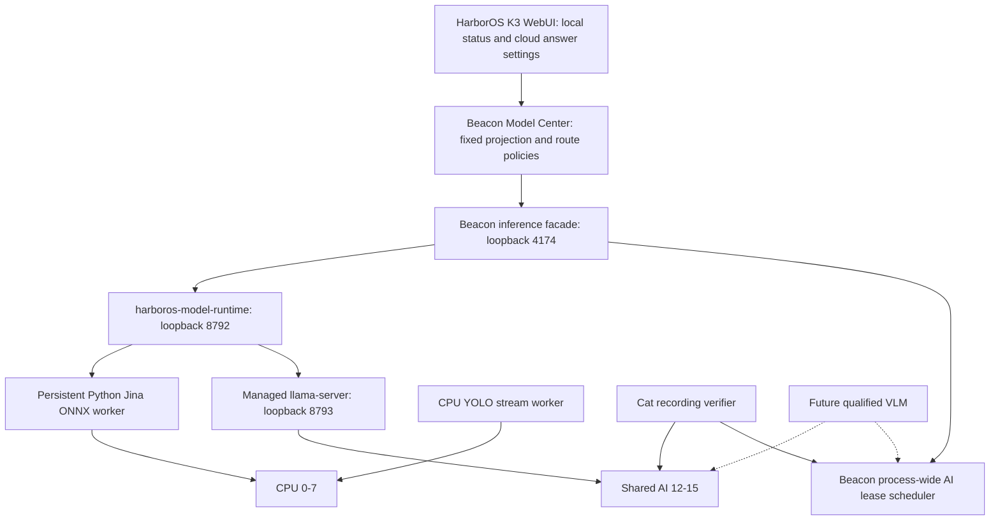

# N2 Fixed Local Models

Implementation branch: `codex/n2-fixed-models-20260905`. N1 and N2 share the
Beacon source tree. This is a short integration branch, not a separate product
mainline. The HarborOS K3 WebUI/product changes live in the matching HarborOS
integration branch.

Startup isolation is evolving under [Option B](n2-capability-startup.md).
Its first batch does not remove the model restart or generation protections
described below, and must not be reported as installed-stack acceptance.

## Build And Execution Boundaries

| Product | Cargo features | Local model management | Execution |
| --- | --- | --- | --- |
| N1 | default | Configurable | Existing Candle runtime |
| N2 | `--no-default-features --features fixed-local-models` | Fixed by build and asset pins | External runtime facade |

`fixed-local-models` implies `external-model-runtime` and rejects either Candle
or local model management features at compile time. N2 excludes `hf-hub` and
the download/install workers. The shared lockfile retains N1 dependencies.
N1 Debian/service definitions remain at `debian/`; N2 Beacon uses `debian/n2/`.

There is one AI lease acquisition for fixed chat, in Beacon's inference facade.
Model Center does not acquire a second lease before calling that facade.
Loopback inference is authenticated with the shared product token; the managed
llama child also requires the token. Health remains independently available.

The runtime has separate bounded admission and execution queues for chat and
embedding (four waiting requests at each stage). A request has one 90-second
deadline starting at admission, including queue wait and cold startup. Chat has
one slot, a 4096-token context, and four AI workers. On an uncertain execution
failure, the adapter kills and reaps its child before reporting resources free.
Unconfirmed termination quarantines the worker; Beacon also quarantines its AI
lease when the adapter cannot confirm termination. Restart recovery must stop
the old runtime control group before starting a new Beacon scheduler. The N2
Beacon unit verifies the package generation and synchronously restarts runtime
in `ExecStartPre`, including automatic Beacon crash recovery. This deliberately
reloads resident models after a Beacon restart; lease state cannot survive the
old Beacon process.

## K3 Resource Allocation

| Workload | Placement | Lease lifetime |
| --- | --- | --- |
| Current YOLO | CPU provider, CPU 0-7, one intra-op thread by default | No AI lease |
| Jina embedding | CPU provider, CPU 0-7, four intra-op threads | Separate bounded CPU worker |
| Qwen NSR/chat/answer | AI 12-15 | One inference request, including cold load |
| Cat recording verifier | AI 12-15 | Confirmed child execution and exit |
| Future VLM | AI 12-15, after qualification | Same scheduler and termination contract |
| Future AI YOLO | AI 8-11, after provider qualification | Existing cluster-0 contract |

Model residency does not hold an AI lease. Beacon warms the 1.5B model through
its own facade, then releases the lease while weights remain resident. The
installed EVT.1 YOLO provider is CPU-only; it previously acquired an unnecessary
AI cluster-0 lease, which this change removes. No unqualified AI YOLO provider
is enabled by this change.

The shared AI queue starts with priorities LLM=0, cat verifier=5, VLM=10. Waiting
reduces the priority value by one per second to a floor of zero, then FIFO order
breaks ties. A VLM that waits ten seconds can no longer be bypassed indefinitely
by newly arriving LLM requests. This is request-level scheduling: an active
generation is not preempted, and it does not promise a ten-second VLM deadline.
Future VLM integration must measure queue delay under real NSR and answer load
before being enabled in the product inventory.

## Model Identity And Migration

| Asset | Pinned identity |
| --- | --- |
| Chat | Qwen/Qwen2.5-1.5B-Instruct-GGUF, revision `91cad51170dc346986eccefdc2dd33a9da36ead9`, Q4_K_M |
| Chat SHA-256 | `6a1a2eb6d15622bf3c96857206351ba97e1af16c30d7a74ee38970e434e9407e` |
| Jina revision | `998b9133910ffcb127a7bff233f41db6ed9be4d2` |
| ONNX SHA-256 | `4b0e9fa6e5c77cff56e0c9c673ba1aad61e793e592fdd4b05690b68826b7d3a2` |
| Tokenizer SHA-256 | `0046da43cc8c424b317f56b092b0512aaaa65c4f925d2f16af9d9eeb4d0ef902` |
| Embedding execution identity | `jina-v2-base-zh-998b913-onnx-fp32-mean-l2-v1` |
| Vendor runtime | SpacemiT llama.cpp v0.1.8 and Spine Runtime 0.6.1 |

The chat digest matches Ney's tested asset. Its verified source is the official
Qwen repository. Full vendor archive and license hashes are in
`models/n2-vendor-runtime.json`. Vendor libraries are private to
`/usr/lib/harboros-model-runtime/vendor`; the existing system ONNX Runtime is not
replaced. The adapter retains the original Rust tokenizer, mean pooling, L2
normalization, and 768-dimensional output.

Local endpoint changes, downloads, installation, directory changes, selection,
and binding return `403 LOCAL_MODELS_FIXED`. Cloud LLM credentials remain
editable. Answer policy can allow cloud fallback after the fixed local endpoint;
it cannot become cloud-only or change local endpoint identity. Other local
policies are restored from the product defaults. Cloud endpoints cannot be
converted to local endpoints or overwrite protected IDs.

Legacy local settings are ignored on every state projection. The first state
write preserves the complete old file as `*.pre-fixed-models.json`, including
cloud credentials and user configuration. The on-disk state and backup require
the same restricted permissions as the existing service data.

Embedding identity changes invalidate query/vector compatibility. Before the
existing indexing job replaces an old generation, it atomically preserves the
manifest, vectors, and HNSW data in `*.embeddings.pre-fixed-models/`. Indexing
reports embedding progress and respects cancellation. Original documents remain
unchanged; mismatched or unavailable vectors use the existing text search path.
Never restore only an old vector file beside a new manifest or execution identity.

## Verification Status: 2026-09-05

Source-level checks passed for N1 model management and Model Center; N2 fixed
state, HTTP mutation boundaries, child reaping, input/output contracts, feature
isolation, scheduler fairness/quarantine, index backup, package metadata, and
model provenance. Desktop and 390-pixel mobile WebUI fixture tests cover readonly
models, legacy links, retry, cloud policy save, and absent management polling.
These browser checks use the production bundle with API fixtures, not a deployed
new Beacon service.

Native `.147` probes used the pinned vendor binaries and model files in a
separate qualification directory, without replacing running production services:

- Cold llama startup: 25.03 s; Chinese 26-token response: 1.73 s, about 17 tokens/s.
- Resident llama idle for 5 s: zero observed CPU time increment. Cat verifier on
  the same AI cores: 51.91 ms inference, followed by a 0.141 s llama response
  without reloading its weights. Cat input was a synthetic tensor.
- Real Chinese, English, mixed and 258-token long inputs: normalized, finite
  768-dimensional vectors. Maximum coordinate difference from installed Candle
  was approximately 2.9e-6. Batch and individual outputs matched exactly.
- The actual package-private vendor layout passed native `ldd` and version
  execution with the existing visual ONNX installation.
- Concurrent CPU YOLO and llama: 81 synthetic 192x320 inferences over eight
  seconds, mean 98.84 ms and maximum 114.88 ms; a concurrent 35-token answer took
  2.71 s (15.95 generated tokens/s). YOLO affinity was CPU 0-7. This probe tested
  native engine coexistence, not the installed Beacon scheduler or real video.
- Native disposable systemd fixtures passed manual Beacon restart and simulated
  Beacon crash recovery: both old runtime and its child exited before the new
  scheduler service became active. Full installed-stack lifecycle remains pending.

The kernel reports missing `/dev/tcm_sync_mem`; the vendor runtime's fallback
path completed these probes. This is recorded behavior, not a claim that every
vendor acceleration path is enabled. The tested device has approximately 32 GB
RAM. No real camera was registered during qualification.

Still required before release acceptance: clean Linux/RISC-V package build,
installed adapter timeout/restart/control-group tests, coordinated `.147`
upgrade, data import/reindex/cited-answer loop, and an exercised full rollback.
The source implementation and native engine probes do not replace those gates.
See `n2-fixed-models-upgrade.md` for the coordinated sequence.
